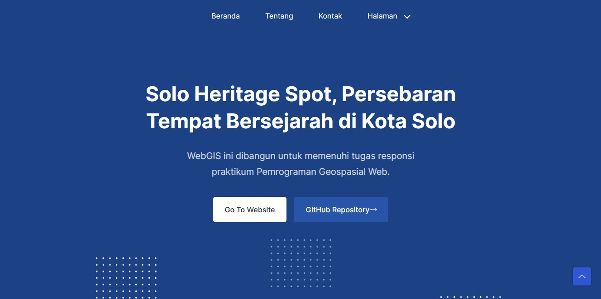
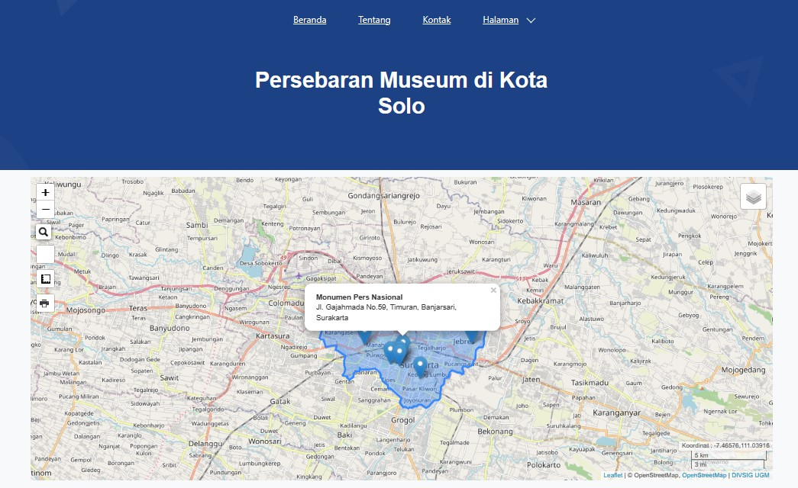
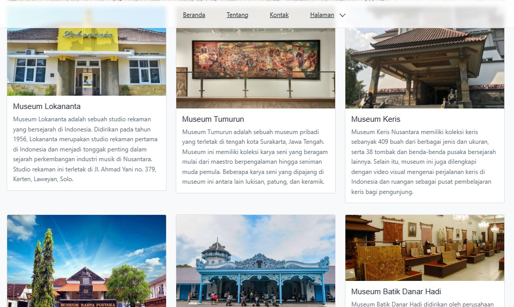

# pgweb-responsi

## Demo Produk
(https://farmanaditya.github.io/pgweb-responsi/)

# Solo Heritage Spot

Solo Heritage Spot adalah  laman yang menampilkan informasi museum serta tempat bersejarah di kota Solo.WebGIS Solo Heritage Spot dibuat karena banyaknya tempat bersejarah di Kota Solo yang kurang dikenal oleh banyak orang. Dengan menggunakan peta interaktif, website ini membantu orang untuk menemukan dan memahami lebih banyak tentang tempat bersejarah dan tempat menarik lainnya di kota ini. Solo Heritage Spot dibangun untuk memenuhi tugas responsi praktikum Pemrograman Geospasial Web

## Komponen Pembangun Produk

- **HTML:** Digunakan untuk struktur dasar halaman web.
- **CSS:** Menangani tata letak dan desain halaman.
- **Bootstrap:** Framework CSS untuk mempercepat pengembangan antarmuka pengguna yang responsif.
- **Leaflet.js:** Library JavaScript untuk menangani peta interaktif.
- **Geoserver:** Digunakan sebagai server GIS untuk menyediakan dan mengelola data geospasial.

## Sumber Data

- Data tentang museum dan tempat bersejarah diambil dari [pariwisatasolo.surakarta.go.id](https://pariwisatasolo.surakarta.go.id/).
- Data geospasial diakses melalui [InaGeoportal](https://www.inageoportal.id/).
- Data icon diambil dari [SVG Repo](https://www.svgrepo.com/)
- Desain antarmuka [Templates](https://github.com/uideck/play-bootstrap)

## Tangkapan Layar Komponen Penting Produk

1. **Antarmuka Utama:**
   

2. **Peta Persebaran:**
   

3. **Informasi Lanjutan:**
   

